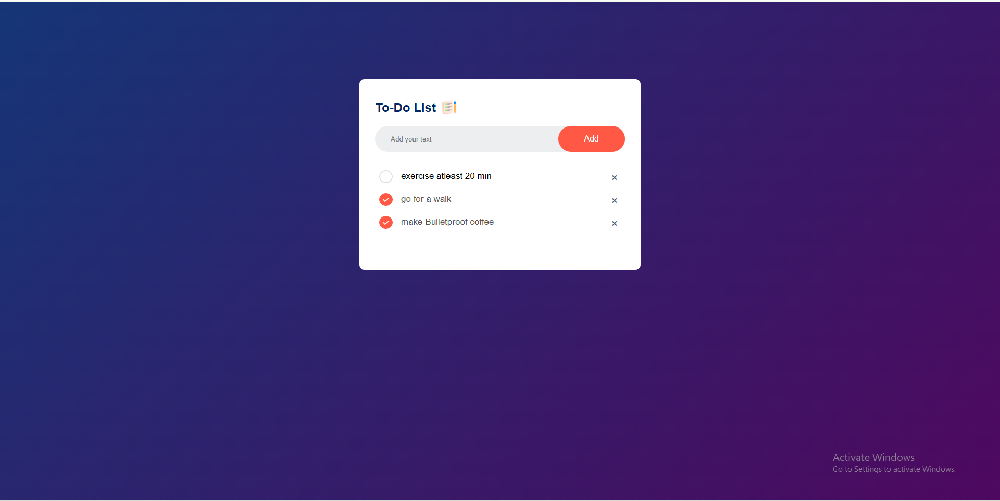
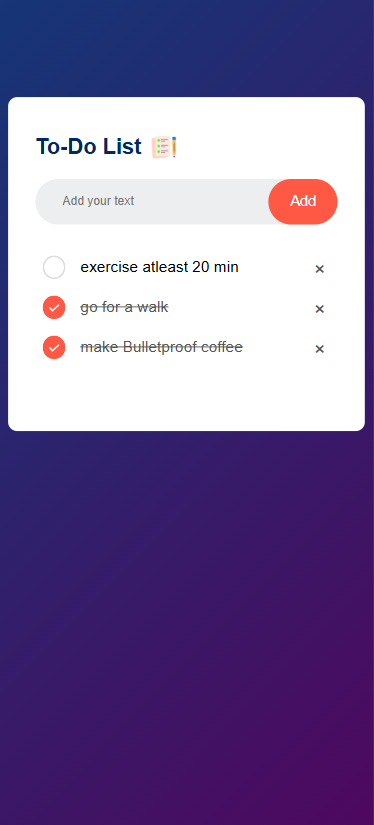

# ✅ ToDo App

A simple and responsive to-do application built using **HTML**, **CSS**, and **JavaScript**. The application allows users to manage daily tasks by adding new tasks, marking them as completed, deleting them, and automatically saving them in the browser using Local Storage.

---

## ✨ Features

- ➕ Add new tasks
- ✅ Mark tasks as completed
- 🗑 Delete tasks
- 💾 Automatically save tasks using Local Storage
- 🔄 Tasks persist after refreshing the page
- 📱 Responsive and clean user interface

---

## 🛠 Technologies Used

- HTML5
- CSS3
- JavaScript (ES6)
- Browser Local Storage API

---

## 📁 Project Structure

```
todoApp/
├── css/
├── js/
├── index.html
└── README.md
```

---

## 🚀 Getting Started

### 1. Clone the repository

```bash
git clone https://github.com/prahans/todoApp.git
```

### 2. Navigate to the project

```bash
cd todoApp
```

### 3. Open the application

Open `index.html` in your preferred web browser.

---

## 📸 Screenshot

<p align="center">
  
</p>
<p align="center">
  
</p>

---

## 📚 What I Learned

This project helped me strengthen my understanding of:

- DOM Manipulation
- JavaScript Event Handling
- Working with Arrays and Objects
- Browser Local Storage API
- Responsive Web Design
- Building Interactive User Interfaces

---

## ⭐ Support

If you found this project helpful, consider giving it a ⭐ on GitHub.

---

## 📄 License

This project is for educational purposes only.
